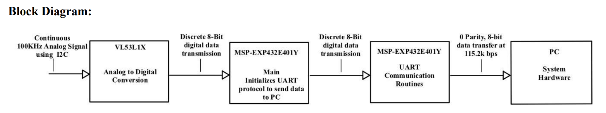
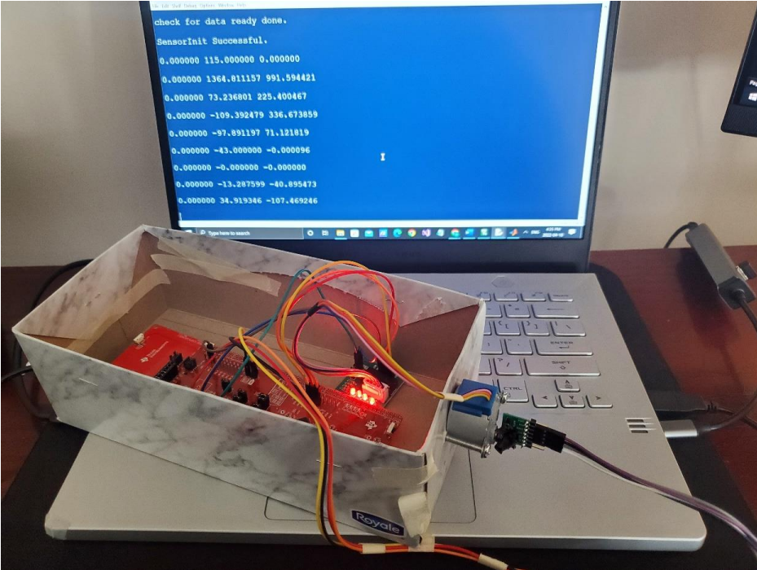
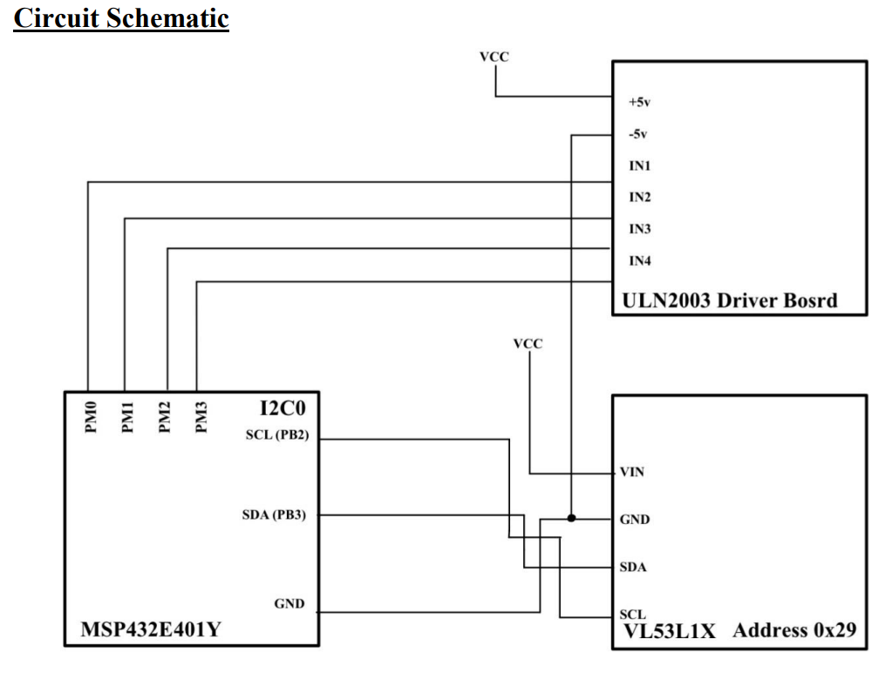
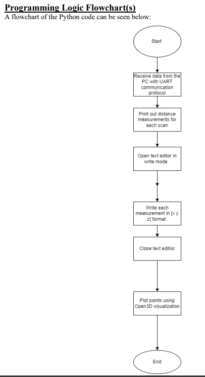

# 2DX Spatial Mapping System

## Table of Contents
- [Overview](#overview)
- [Features](#features)
- [Hardware Specifications](#hardware-specifications)
- [Device Characteristics](#device-characteristics)
- [Detailed Description](#detailed-description)
- [Distance Measurements](#distance-measurements)
- [Visualization](#visualization)
- [Application Guide](#application-guide)
- [Setup Guide](#setup-guide)
- [Expected Output](#expected-output)
- [User Guide](#user-guide)
- [Limitations](#limitations)
- [Circuit Schematic](#circuit-schematic)
- [Programming Logic Flowchart](#programming-logic-flowchart)
- [References](#references)

## Overview
The 2DX spatial mapping system integrates a VL53L1X Time-of-Flight sensor with a UNLN2003 stepper motor to create 3D graphical representations from 360-degree measurements of distance. It is designed for applications like advanced hallway reconstruction and direct data transmission to PCs.

## Features
- **Compact and Portable**: 10.5cm x 20cm x 6cm, secure motor placement, easy storage.
- **Ease of Use**: Simple plug-and-play software, minimal setup, single power supply.
- **Hardware Specifications**: 20MHz bus speed, up to 120MHz clock speed, and multiple communication protocols.

## Hardware Specifications
- **Microcontroller**: MSP-EXP432E401Y with Arm Cortex-M4 processor.
- **Time-of-Flight Sensor**: VL53L1X with 4m range.
- **Stepper Motor**: UNLN2003, capable of 360-degree rotation.
- **Power Requirements**: 5V for stepper motor, 2.6V–3.5V for ToF sensor, 4V for microcontroller.
- **Communication**: I2C and UART at 115200bps.

## Device Characteristics
| Attribute               | Details                          |
|-------------------------|----------------------------------|
| Weight                  | 1.34 kg                          |
| Pins                    | PM0-PM3, PB2-PB3, PJ1, GND, etc. |
| Bus Speed               | 20MHz                            |
| Baud Rate               | 115200bps                        |
| Clock Speed             | Up to 120MHz                     |
| Dimensions              | 10.5cm x 20cm x 6cm              |
| Voltage Requirements    | Various (2.6V–5V)                |
| Software Requirements   | Python 3.6-3.9, Keil             |

## Detailed Description
The system is built with an MSP-EXP432E401Y microcontroller, a VL53L1X ToF sensor, and a UNLN2003 stepper motor. The microcontroller manages data acquisition and motor control, making it ideal for embedded systems with high performance and easy customization.

### Block Diagram

## Distance Measurements
Distance is captured via the ToF sensor through analog to digital conversion and communicated via I2C. Measurements are taken by the rotating stepper motor and are sent to a PC using UART for 3D plotting.

### Spatial Mapping Process

## Visualization
Data from the microcontroller is visualized on a PC using Python and Open3D libraries. This allows the creation of a 3D spatial map of the environment based on the data collected.

## Application Guide
1. Connect the system to a PC via USB 3.0.
2. Hold the device at the center of the room.
3. Launch Keil and load the provided `.c` file.
4. Follow on-screen instructions for scanning.

## Setup Guide
1. Install Keil and Python 3.6-3.9.
2. Install `pyserial` using `pip install pyserial`.
3. Set the correct COM port in the Python script.

## Expected Output
The expected output is a 3D spatial map, accurately reflecting the scanned environment, such as a hallway. Minor errors may occur due to wiring interference.

## User Guide
1. Connect the system to your PC using USB 3.0.
2. Run the Python script and start the device via the on-board push button.
3. Perform scans and observe the 3D visualization.

## Limitations
1. Floating-point rounding errors can affect measurement accuracy.
2. Limited by the maximum baud rate of 115200bps.
3. ToF sensor speed limits overall system performance.

## Circuit Schematic

## Programming Logic Flowchart

## References
1. [Cortex-M4 Technical Reference Manual](https://avenue.cllmcmaster.ca/d2l/le/content/418585/viewContent/3472453/View)
2. [VL53L1X Datasheet](https://www.alldatasheet.com/view.jsp?Searchword=Vl53l1x%20datasheet&gclid=Cj0KCQjwgMqSBhDCARIsAIIVN1V7fnHAbqDNCxIoIYQLRB77Kj-EOxhhvR457wBa6sC81iszBUtIGpoaAv0hEALw_wcB)
3. [2DX4 Lab 4 ULN2003A-PCB Stepper Motor Drivers Datasheet](https://avenue.cllmcmaster.ca/d2l/le/content/418585/viewContent/3593206/View)
4. [System Requirements](https://www2.keil.com/system-requirements/)
